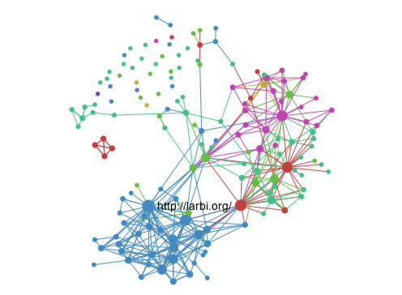

# 简介 {#htmlwidgets-intro}

## 概况

[htmlwidgets](https://cran.r-project.org/web/packages/htmlwidgets/index.html)包提供了一个R语言链接Javascript库的框架,HTML控件能够：

+ 在R命令中做分析比如方便的R作图

+ 和R Markdown结合在一起

+ 和shiny结合在一起

+ 保存为独立的网页，通过电子邮件，Dropbox等ad-oc共享。

通过遵循一小部分易于遵循的约定，可以创建非常小的代码和HTML控件，所有控件包含如下部分：

1. *Dependencies*: 这些是控件用到的需要声明的Javascript和CSS

2. *R binding*: 这是终端用户将调用的功能，以向控件提供输入数据，并制定控件应该如何呈现各种选项，这包括在shiny应用程序中使用控件所需要的一些简短的样板功能。

3. *javaScript binding*: 这是JavaScript代码，把所有的东西粘在一起。将R绑定中收集的数据和选项传递给底层的JavaScript库

已经有非常多的包基于htmlwidgets去完成,包括：

+ leaflet -- 交互的地图绘制包

+ dygraphs -- 交互时间序列绘图包

+ networkD3 -- 基于D3.js的交互网络图可视化

+ sparkline -- 小型的内联图

+ DT -- 表格可视化

+ rthreejs -- 交互3D图

包的作者包括：Ramnath Vaidyanathan, Joe Cheng, JJ Allaire, Yihui Xie, and Kenton Russell等。

HTML控件一般会寄存在一个R包中，并且应该包含他们的依赖关系的所有源代码，例如这里译者写的以个基于htmlwidgets的R包:[XuJIngd3plus](https://github.com/DataXujing/XuJIngd3plus)。这是为了确保依赖的控件的完全可重复的(既不需要联网，也不需要运行服务器)，说白了在你R包中，应该包含所有的源码包括你底层调用的JavaScript包或CSS。

## 简单的开始

如果你懂R语言和一点JavaScript,创建自己的小控件非常简单，最先要做的就是要安装htmlwidgets,在CRAN上：

```r
install.packages('htmlwidgets')
```

你也可以在GitHub上安装开发版本：

```r
devtools::install_github('ramnathv/htmlwidgets')
```
通过包中自带的说明文档，让你快速的熟悉htmlwidgets并进入开发者状态,包括：

+ Introduction to HTML Widgets

+ HTML Widget Sizing

+ HTML Widgets: Advanced Topics

我们会持续把他们翻译成中文,让中国人看起来更爽。


## 例子(sigma.js)

首先，我们将通过创建一个控件来封装[sigma.js](http://sigmajs.org/)图形可视化库。当我们完成后，我们可以用来显示[GEXF](https://gephi.org/gexf/format/)(Graph Exchange XML Format)数据文件的交互可视化，例如：

```R
library(sigma)
data <- system.file("examples/ediaspora.gexf.xml", package = "sigma")
sigma(data)
```



注意上面的输出仅仅是一个静态图像，你可以按照下文的Demo做一个交互的版本。

创建这种绑定所需的代码非常少。下面我们将一步一步地介绍所有的控件。然后，我们将描述如何创建自己的控件（包括为所有核心组件自动生成基本的脚手架）。


### 文件布局

假设我们的控件被命名为**sigma**,并且位于同名的R包中。我们的JavaScript绑定源代码文件名为sigma.js。由于我们的控件将读取GEXF数据文件，我们还需要包括基础sigma.min.js库以及GEXF插件，下面是我们将添加到包中的文件：

```powershell
R/
| sigma.R

inst/
|-- htmlwidgets/
|   |-- sigma.js
|   |-- sigma.yaml
|   |-- lib/
|   |   |-- sigma-1.0.3/
|   |   |   |-- sigma.min.js
|   |   |   |-- plugins/
|   |   |   |   |-- sigma.parsers.gexf.min.js

```

请注意，JavaScript,YAML和其他依赖项都包含在inst/htmlwidgets目录中(随后将被安装到一个名为htmlwidgets的包的子目录中)。


### 依赖关系

依赖项是控件使用的JavaScript和CSS资源。依赖项包含在inst/htmlwidgets/lib目录中。依赖关系是使用YAML配置文件指定的，该文件使用控件的名称作为其基本文件名。以下是我们的sigma.yaml文件的样子

```powershell
dependencies:
  - name: sigma
    version: 1.0.3
    src: htmlwidgets/lib/sigma-1.0.3
    script: 
      - sigma.min.js
      - plugins/sigma.parsers.gexf.min.js
```
依赖关系src详述了引用目录，包含库和指定的JavaScript代码文件。如果包含多个JS脚本，每一个占每一行，并且以‘-开头。同时你可以天剑stylesheet条目，还有元条目或头条目，多依赖关系可以在一个YAML文件中声明，更多的请参考htmlDependency函数，该函数在[htmltools](https://cran.r-project.org/web/packages/htmltools/index.html)包中


### R绑定(R binding)

我们需要为用户提供一个调用我们的控件的R函数。通常，该函数将接受输入数据以及控制控件的显示的各种选项。下面是sigma的R函数：

```r
#' @import htmlwidgets
#' @export
sigma <- function(gexf, drawEdges = TRUE, drawNodes = TRUE,
                  width = NULL, height = NULL) {
  
  # read the gexf file
  data <- paste(readLines(gexf), collapse="\n")
  
  # create a list that contains the settings
  settings <- list(
    drawEdges = drawEdges,
    drawNodes = drawNodes
  )
  
  # pass the data and settings using 'x'
  x <- list(
    data = data,
    settings = settings
  )
  
  # create the widget
  htmlwidgets::createWidget("sigma", x, width = width, height = height)
}
```

函数包含两类输入：GEXF数据文件和一些附加的设置参数用来控制如何显示图片。这些输入都集中在一个叫做x的列表中，然后灌入到htmlwidgets::createWidget函数。这个x变量随后将被用于sigma的JavaScript绑定（下面将对此进行描述）,指定的任何宽度或高度参数也会被转发到widget（默认情况下，控件自动调整大小，因此通常不需要显式的宽度或高度）。

我们也希望sigma控件能够在shiny应用中使用，因此我们添加了下面的公式化的shiny output和render函数（对于所有的控件来说，它总是相同的）

```r
#' @export
sigmaOutput <- function(outputId, width = "100%", height = "400px") {
  htmlwidgets::shinyWidgetOutput(outputId, "sigma", width, height, package = "sigma")
}
#' @export
#https://blog.csdn.net/songzhilian22/article/details/49487467
renderSigma <- function(expr, env = parent.frame(), quoted = FALSE) {
  if (!quoted) { expr <- substitute(expr) } # force quoted
  htmlwidgets::shinyRenderWidget(expr, sigmaOutput, env, quoted = TRUE)
}

```

### JavaScript绑定(JavaScript binding)

注意：在htmlwidgets0.5.2和更早的版本中使用了一个更老、更不直观的JavaScript绑定API，并在htmlwidgets的更新版本中继续支持。有关遗留绑定API的详细信息，请参见此归档版本。新的控件件被鼓励使用下面描述的更新的API。谜题中的第三个部分是激活控件所需的JavaScript。按照惯例，我们将在文件inst/htmlwidgets/sigma.js中定义JavaScript绑定。下面是绑定的完整源代码：

```javascrit
HTMLWidgets.widget({

  name: "sigma",
  
  type: "output",
  
  factory: function(el, width, height) {
  
    // create our sigma object and bind it to the element
    var sig = new sigma(el.id);
    
    return {
      renderValue: function(x) {
          
        // parse gexf data
        var parser = new DOMParser();
        var data = parser.parseFromString(x.data, "application/xml");
        
        // apply settings
        for (var name in x.settings)
          sig.settings(name, x.settings[name]);
        
        // update the sigma object
        sigma.parsers.gexf(
          data,          // parsed gexf data
          sig,           // sigma object
          function() {
            // need to call refresh to reflect new settings and data
            sig.refresh();
          }
        );
      },
      
      resize: function(width, height) {
        
        // forward resize on to sigma renderers
        for (var name in sig.renderers)
          sig.renderers[name].resize(width, height);  
      },
      
      // Make the sigma object available as a property on the widget
      // instance we're returning from factory(). This is generally a
      // good idea for extensibility--it helps users of this widget
      // interact directly with sigma, if needed.
      s: sig
    };
  }
});

```

我们为控件提供了名称和类型，再加上一个工厂函数，它采用el（将承载这控件的HTML元素）、宽度和高度（HTML元素的宽度和高度，以像素为单位），您总是可以使用OffStStand宽度和OffSETHEE来实现这一点。

工厂函数要准备启动接收HTML元素的值。在这个案例，我们创建一个新的sigma元素和把它的DOM元素的ID，承载页面的控件。

我们稍后需要访问sigma对象（以更新它的数据和设置），因此我们将其保存为变量sig。请注意，直接在工厂函数内部声明的变量与特定的控件实例/el绑定。

工厂函数的返回值被称为控件实例对象。它是htmlwidgets运行时和正在包装的JavaScript可视化之间的桥梁。顾名思义，每个控件实例对象负责管理页面上的单个控件实例。

您创建的控件实例对象必须有一个所需的方法，并且可以有一个可选的方法：

1. 所需的renderValue方法实际上将动态数据和设置填充到WEB的DOM元素中。x包含控件数据和设置。我们解析和更新GEXF数据，将设置应用到我们先前创建的sig  Sigma对象，最后调用刷新以反映屏幕上的新值。这种方法可以重复调用不同的数据（例如：在shiny中），所以一定要考虑到这种可能性。如果它对你的控件有意义，
考虑使您的可视化转换顺利地从x的一个值开始到另一个。

2. 每当包含控件的元素被调整大小时，就会调用可选的大小调整方法。不执行此方法的唯一原因是如果您的控件自然缩放（当它的元素大小改变时不需要附加的JavaScript代码）。在sigma .js的情况下，我们将大小调整信息转发给每个底层sigma渲染器。

所有JavaScript库都处理初始化、绑定到DOM元素、动态更新数据和稍微不同地调整大小。创建控件的JavaScript方面的大部分工作是将这三个函数工厂、渲染值和大小正确地映射到底层库的行为。sigma.js示例使用一个简单的对象文字来创建它的控件实例对象，但是您也可以使用基于类的对象或任何其他样式的对象，只要obj.renderValue(x)和obj.resize(width, height)（宽度，高度）可以调用它。

可以在控件实例对象上添加其他方法和属性。虽然它们不会被htmlwidgets本身调用，但它们可能对知道一些JavaScript的控件的用户有用，并希望通过添加自定义JS代码（例如使用htmlwidgets::onRender R函数）来进一步定制您的控件。在这种情况下，我们添加一个s属性，使sigma对象本身可用。

### 演示

我们的控件现在完成了！如果您想在不重放所有代码的情况下测试它，您可以从GitHub安装它如下：

```r
devtools::install_github('jjallaire/sigma')
```

下面是代码的示例，其中包含了包中包含的一些示例数据：

```r
library(sigma)
sigma(system.file("examples/ediaspora.gexf.xml", package = "sigma"))
```
如果在R控制台中执行此代码，您将看到在RStudio Viewer中显示的控件（或者如果不运行RStudio，则在外部浏览器中）。如果将其包含在R Markdown文档中，则窗口控件将嵌入到文档中。

我们还可以在shiny应用程序中使用控件：

```r
library(shiny)
library(sigma)

gexf <- system.file("examples/ediaspora.gexf.xml", package = "sigma")

ui = shinyUI(fluidPage(
  checkboxInput("drawEdges", "Draw Edges", value = TRUE),
  checkboxInput("drawNodes", "Draw Nodes", value = TRUE),
  sigmaOutput('sigma')
))

server = function(input, output) {
  output$sigma <- renderSigma(
    sigma(gexf, 
          drawEdges = input$drawEdges, 
          drawNodes = input$drawNodes)
  )
}

shinyApp(ui = ui, server = server)

```


## 创建你自己的widgets


### 需求（Requirements）

要实现一个控件，您需要创建一个新的R包，而这又取决于htmlwidgets包。可以在CRAN中安装：

```r
install.packages("htmlwidgets")
```

### 脚手架（Scaffolding）


要创建一个新的控件，可以调用**scaffoldWidget**函数来生成控件的基本结构。函数将：

+ 创建.R,.js,.yaml等控件需要的文件

+ 如果提供，取一个[Bower](https://bower.io/)包名称并自动下载JavaScript库（及其依赖项），并将所需的条目添加到.yaml文件中。

这个方法是非常推荐的，因为它确保你开始使用正确的文件结构。
下面是一个示例，假设您希望在一个新的同名包中创建名为“mywidget”的小部件：

```r
devtools::create("mywidget")               # create package using devtools
setwd("mywidget")                          # navigate to package dir
htmlwidgets::scaffoldWidget("mywidget")    # create widget scaffolding
devtools::install()  
```

这将创建一个简单的控件，它使用单个文本参数，并在控件HTML元素中显示该文本。你可以这样试试：

```r
library(mywidget)
mywidget("hello, world")
```

这是最可能的控件，并且还没有包含一个JavaScript库来连接（注意，scaffoldWidget可以可选地包含通过JavaScript库依赖关系的bowerPkg参数）这是最可能的小部件，并且还没有包含一个JavaScript库来连接（注意，scaffoldWidget可以可选地包含通过JavaScript库依赖关系的bowerPkg参数）。
在开始开发之前，您应该查看上面的介绍性示例，以确保您理解各个组件，并在下一节中查看与文章相关联的附加文章和示例。


### 更多


#### 其他

还有更多的文章覆盖更高级的领域：

+ HTML Widget Sizing：解释自定义大小调整策略以及何时可能需要使用它们，并描述在JavaScript绑定中实现调整大小的方法。

+ HTML Widgets: Advanced Topics：描述支持每个控件实例数据、数据转换（例如，将数据帧转换为D3数据集）以及提供live JavaScript对象（例如函数定义）的控件选项的框架特征。

当大多数JavaScript库需要一些额外的交互以保持它们的大小与它们的包含元素同步时，HTML Widget Sizing就显得尤为重要。


#### 例子

学习其他包的代码是了解更多关于创建小部件的一个好方法：

+  [networkD3](https://CRAN.R-project.org/package=networkD3) 

+  [dygraphs](https://CRAN.R-project.org/package=dygraphs )

+  [sparkline](https://github.com/htmlwidgets/sparkline)

#### 问题

如果您对开发控件或开发过程中遇到的问题有疑问，请毫不犹豫地在项目的GitHub存储库上发布一个问题。

