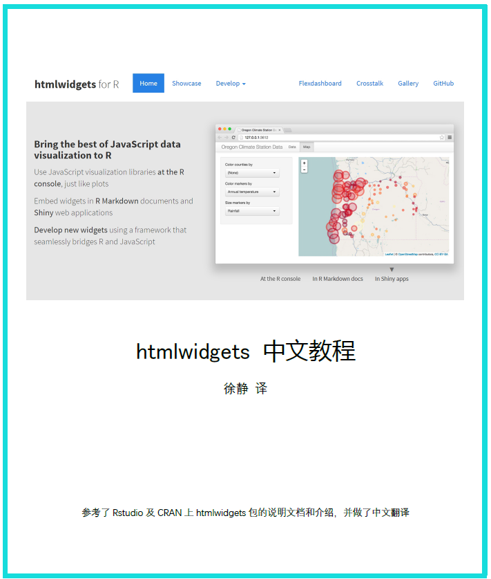

--- 
title: "htmlwidgets中文教程"
author: "徐静 译"
date: "`r Sys.Date()`"
site: bookdown::bookdown_site
documentclass: book
bibliography: [book.bib, packages.bib]
biblio-style: apalike
link-citations: yes
description: "这是一个htmlwidgets的中文教程"
---


# 声明{-}

[htmlwidgets](https://CRAN.R-project.org/package=htmlwidgets)是R语言中非常有划时代意义的包，因为有了htmlwidgets使得R语言在交互可视化和基于JavaScript的编程有了实质性的进步。htmlwidgets目前没有中文说明文档和教程，该文档是对官方文档的详细翻译，译者水平有限，读者可以在<https://github.com/DataXujing/htmlwidgets_CN/issues>中留言指正。



# 序言{-}

htmlwidgets，一个用来创建HTML控件的包，可以运行在R命令行, R Markdown, Shiny。 

```powershell
Type Package
Title HTML Widgets for R
Version 1.2
Description A framework for creating HTML widgets that render in various
contexts including the R console, 'R Markdown' documents, and 'Shiny'
web applications.
License MIT + file LICENSE
VignetteBuilder knitr
Imports grDevices, htmltools (>= 0.3), jsonlite (>= 0.9.16), yaml
Suggests knitr (>= 1.8)
Enhances shiny (>= 1.0.5)
URL https://github.com/ramnathv/htmlwidgets
BugReports https://github.com/ramnathv/htmlwidgets/issues
RoxygenNote 6.0.1
NeedsCompilation no
Author Ramnath Vaidyanathan [aut, cph],Yihui Xie [aut],JJ Allaire [aut, cre],Joe Cheng [aut],
Kenton Russell [aut, cph],RStudio [cph]
Maintainer JJ Allaire <jj@rstudio.com>
Repository CRAN
Date/Publication 2018-04-19 12:43:03 UTC
```

目前针对于htmlwidgets并没有详细的中文教程,译者会持续更新翻译htmlwidgets，并推出更多基于htmlwidgets的R包。

<p style='float:right;'> 徐静  </p>

<br>

<p style='float:right;'> 联信商务咨询有限公司 </p>

<br>

<p style='float:right;'> 2018-07-02 </p>

# 关于译者{-}

**徐静：**

硕士研究生, 目前的研究兴趣主要包括：数理统计，统计机器学习，深度学习，网络爬虫，前端可视化，R语言和Python语言的超级粉丝，多个R包和Python模块的作者，现在正逐步向Java迁移。

Graduate students,the current research interests include: mathematical statistics, statistical machine learning, deep learning, web crawler, front-end visualization.
He is a super fan of R and Python, and the author of several R packages and Python modules, and now gradually migrating to Java.


